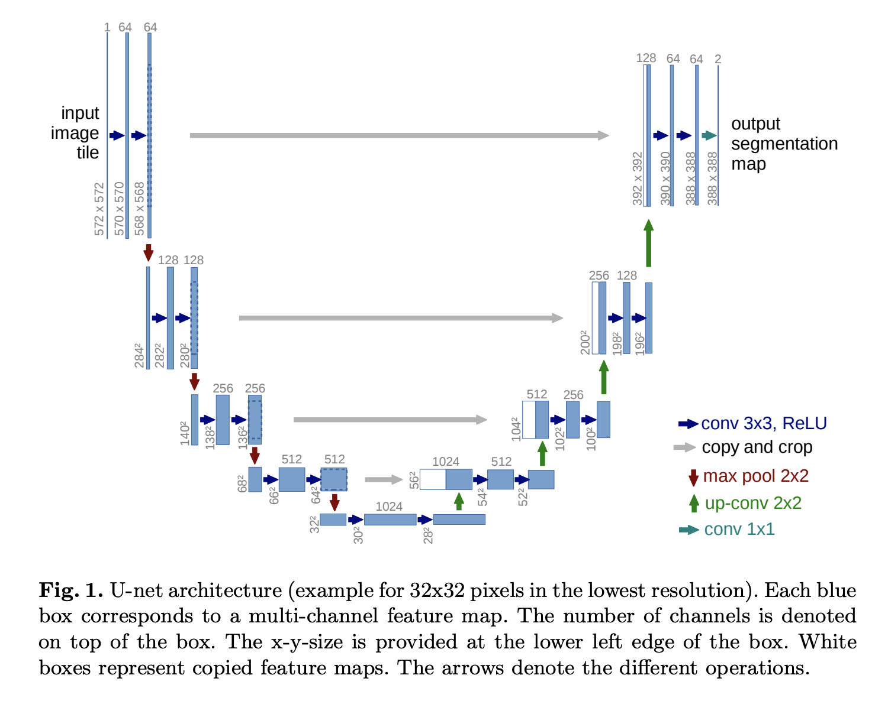

# Diffusion Models [WIP]

Work-in-progress notes on diffusion models.

Diffusion models were originally inspired by nonequilibrium thermodynamics (Sohl-Dickstein et al, [2015](https://arxiv.org/abs/1503.03585)). They are trained by first noising an image using a Gaussian distribution and then predicting how much noise was added. This happens in a series of steps (Markov chain) of increasing noise. A trained model can then be given pure noise and over a number of denoising steps ultimately generate an image.

Use cases include unconditioned generation, like human face synthesis and photo super-resolution; and conditioned generation, like text-to-image and image inpainting.

## U-Net

_Source: [Papers with Code](https://paperswithcode.com/method/u-net)_

A key component of diffusion models is the U-Net architecture. Originally developed for medical _image segmentation_, a computer vision task that splits an image into groups or "segments" of related pixels, making it easier to analyze.

U-Net uses a series of convolutional layers to downsample the image followed by a series of layer to upsample the image. The architecture is called U-Net because the shape of the network looks like a "U". It also uses recurrent connections to pass information directly from the downsampling layers to the upsampling layers.

### Autoencoders

U-Net is a type of _autoencoder_. The goal of an autoencoder is to learn a compressed representation of the input data (images in this case) known as the _latent space_.

The latent space is a lower-dimensional representation of the data that captures the most important attributes. The model learns how to reconstruct the input data from this space by minimizing the difference between the input and the output (reconstruction error).

> When I was in school, some professors allowed us to bring a "cheat sheet" as long as it was handwritten and fit on a single 3x5 note card. You'd have to use your own "encoding" by abbreviating and using symbols. You wouldn't waste space on things you already knew or superfluous language (noise). The card was your "latent space".

In text-to-image models like Stable Diffusion, there are 2 latent spaces: the image representation learned by the image encoder, and the text representation learned by the text encoder (prompt).

In the case of generative video, _latent space walking_ is the process of sampling a point in the latent space and incrementally changing the latent representation so the generated sequence of images remains coherent.

### Bottleneck

The "bottom" of the U-Net is the _bottleneck_. This is where the latent space is located. It has the fewest number of neurons, so the data is squeezed to its most compact form here.

## Resources

### Posts

* <https://huggingface.co/blog/annotated-diffusion>
* <https://lilianweng.github.io/posts/2021-07-11-diffusion-models>
* <https://jalammar.github.io/illustrated-stable-diffusion>
* <https://keras.io/examples/generative/random_walks_with_stable_diffusion>
* <https://www.assemblyai.com/blog/diffusion-models-for-machine-learning-introduction>
* <https://blog.marvik.ai/2023/11/28/an-introduction-to-diffusion-models-and-stable-diffusion>
* <https://www.analyticsvidhya.com/blog/2023/08/unet-architecture-mastering-image-segmentation>
* <https://towardsdatascience.com/understanding-u-net-61276b10f360>

### Papers

* [U-Net: Convolutional Networks for Biomedial Image Segmentation](https://arxiv.org/abs/1505.04597)
* [Denoising Diffusion Probabilistic Models](https://arxiv.org/abs/2006.11239) ([code](https://github.com/hojonathanho/diffusion))
* [Improved Denoising Diffusion Probabilistic Models](https://arxiv.org/abs/2102.09672) ([code](https://github.com/openai/improved-diffusion))
* [Diffusion Models Beat GANs on Image Synthesis](https://arxiv.org/abs/2105.05233) ([code](https://github.com/openai/guided-diffusion))

### Videos

* [@AICoffeeBreak](https://www.youtube.com/watch?v=344w5h24-h8)
* [@rupert_ai](https://www.youtube.com/watch?v=NhdzGfB1q74)
* [@YannicKilcher](https://www.youtube.com/watch?v=W-O7AZNzbzQ)
* [@AssemblyAI](https://www.youtube.com/watch?v=yTAMrHVG1ew)
